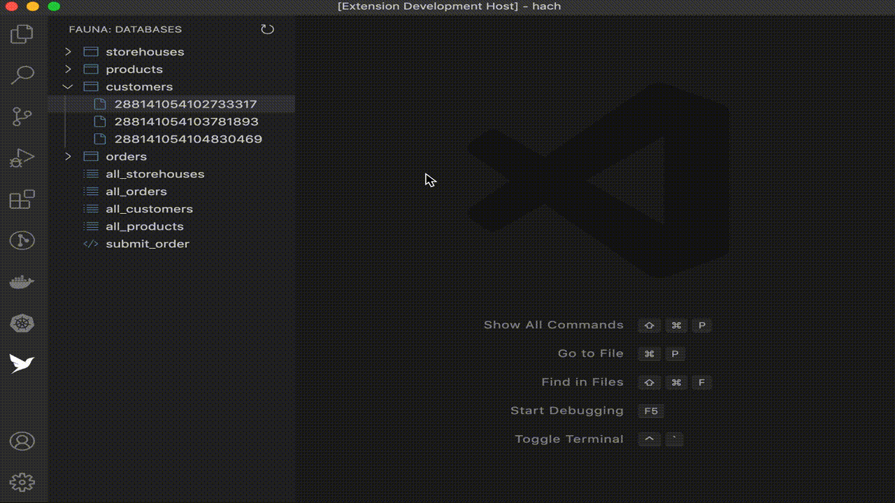

# FaunaDB

VS Code extension for FaunaDB.

## Getting Started

To get started using the Fauna VS Code extension, you'll need to set your secret key in order to access database information. Keys can be created in the [Fauna Console webapp](https://dashboard.fauna.com/) or via the [Shell CLI](https://github.com/fauna/fauna-shell).

To set the key, go to `Code > Preferences > Settings > Extensions > FaunaDB`.

* `faunadb.secretKey`: Your database secret.

> WARNING: Be careful! To avoid exposing this secret, do not commit it to your local `.vscode` configuration.

## Features

**Commands**

* FaunaDB: Create query
* FaunaDB: Run query

### Browse database

With this extension, you can browse the databases, indexes, collections, documents, and functions associated with your Fauna database right inside of the VS Code sidebar.

### Run queries

In addition to browsing your data, this extension also allows you to run [FQL](https://docs.fauna.com/fauna/current/api/fql/) queries against your Fauna database.

## Release Notes

### 1.0.0

* Browse databases, indexes, collections, documents, and functions.
* Run queries
